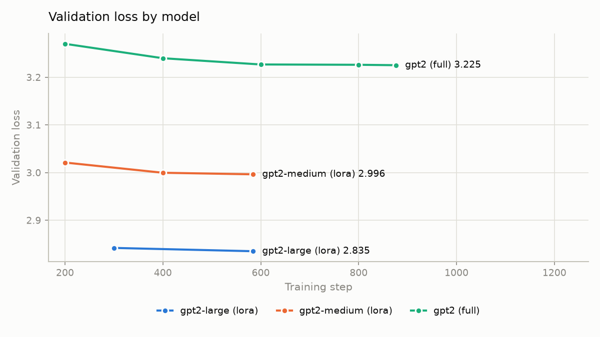
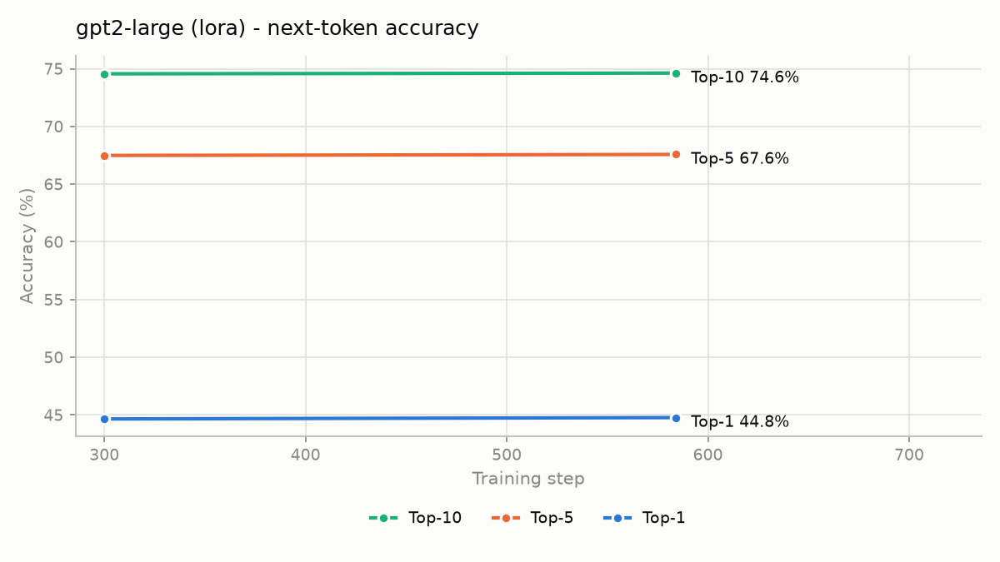

# Next Word Predictor - Fine-tuning GPT-2 on WikiText-2

A transformer language model fine-tuned to predict the next word in a sequence, the task
behind autocomplete, writing assistants, and chat suggestions. Three GPT-2 variants
(`gpt2`, `gpt2-medium`, `gpt2-large`) are fine-tuned on WikiText-2 and evaluated with
**perplexity** and **top-k accuracy**.

Everything here is trained on a single NVIDIA RTX 3050 GPU. That
constraint shaped the design: models too large to fully fine-tune are trained with **LoRA
adapters** instead, selected automatically based on detected VRAM.

---

## Table of contents

- [Results](#results)
- [Preprocessing](#preprocessing)
- [Project layout](#project-layout)
- [Setup](#setup)
- [Training](#training)
- [Evaluation](#evaluation)
- [Dashboard (app.py)](#dashboard-apppy)
- [Reproducing the results](#reproducing-the-results)
- [Extensions](#possible-extensions)

---

## Results

Held-out **test** split, 281,775 tokens, 256-token non-overlapping blocks.

### Fine-tuned models

| Model | Mode | Trainable params | Loss | Perplexity | Top-1 | Top-5 | Top-10 |
|---|---|---|---|---|---|---|---|
| gpt2 | full fine-tune | 124,439,808 (100%) | 3.2200 | 25.03 | 40.92% | 62.65% | 69.86% |
| gpt2-medium | LoRA | 4,325,376 (1.20%) | 2.9735 | 19.56 | 43.45% | 65.89% | 72.99% |
| **gpt2-large** | LoRA | 8,110,080 (1.04%) | **2.8166** | **16.72** | **45.28%** | **67.93%** | **74.95%** |

### Against the untuned baselines

Each fine-tuned model is compared to the *same* pretrained model with no fine-tuning,
scored on identical data through the identical pipeline. This isolates what fine-tuning
actually contributed.

| Model | Baseline ppl | Tuned ppl | Reduction | Baseline top-1 | Tuned top-1 | Gain |
|---|---|---|---|---|---|---|
| gpt2 | 43.60 | 25.03 | **−43%** | 33.79% | 40.92% | +7.13 pp |
| gpt2-medium | 31.29 | 19.56 | **−37%** | 37.60% | 43.45% | +5.84 pp |
| gpt2-large | 27.59 | 16.72 | **−39%** | 38.95% | 45.28% | +6.33 pp |

### Validation loss during training

| Model | Eval 1 | Eval 2 | Eval 3 | Eval 4 | Eval 5 | Best |
|---|---|---|---|---|---|---|
| gpt2 (3 epochs, 876 steps) | 3.2702 | 3.2400 | 3.2270 | 3.2260 | 3.2254 | 3.2254 |
| gpt2-medium (2 epochs, 584 steps) | 3.0210 | 3.0000 | 2.9964 | — | — | 2.9964 |
| gpt2-large (2 epochs, 584 steps) | 2.8420 | 2.8351 | — | — | — | 2.8351 |

### Training cost

| Model | Train time | Peak VRAM | Checkpoint size |
|---|---|---|---|
| gpt2 | 23 min | 3767 MiB | 479 MB (full weights) |
| gpt2-medium | 47 min | 1301 MiB | 20 MB (adapter only) |
| gpt2-large | 79 min | 3955 MiB | 35 MB (adapter only) |

Both LoRA runs beat the full fine-tune while training ~1% of their parameters, and the
gpt2-large adapter is **14× smaller on disk** than the full gpt2 checkpoint.





All plots are in [`results/plots/`](results/plots/) — per-model loss curves, top-k accuracy
curves, and the cross-model comparison. Regenerate with `python -m src.plots`.

### How to read these metrics

- **Perplexity** = `exp(mean token-level cross-entropy)`. Intuitively, "how many words is
  the model effectively choosing between at each position." Lower is better.
- **Top-k accuracy** = fraction of positions where the true next token is among the model's
  k highest-probability predictions. Top-1 is exact-match; top-5 and top-10 reflect how an
  autocomplete UI actually behaves, offering several suggestions at once.

## Preprocessing

Implemented in [`src/data.py`](src/data.py). Four steps:

**1. Load.** WikiText-2 (`wikitext-2-raw-v1`) via HuggingFace `datasets`. The *raw* variant
is used rather than the pre-tokenized one, so GPT-2's byte-pair-encoding tokenizer sees
real text and its vocabulary aligns with what the pretrained model expects.

**2. Tokenize.** GPT-2's BPE tokenizer via `AutoTokenizer`. GPT-2 ships without a padding
token, so `pad_token` is set to `eos_token`; padded positions are masked out of the loss,
so this never contributes a training signal.

**3. Pack into fixed-length blocks.** This is the important design decision. WikiText lines
are frequently just a few tokens — section headers, fragments, blank lines. Tokenizing per
line and padding to a common length would leave most of every batch as padding, wasting
both compute and gradient signal. Instead, all documents are concatenated into a single
token stream and re-sliced into uniform **256-token blocks**:

```
documents  ->  [tok tok tok tok ... one continuous stream ...]  ->  [256][256][256]...
```

Every position now carries real signal and every batch has identical shape. The trailing
remainder that cannot fill a complete block is dropped.

**4. Build labels.** For causal language modelling, `labels` is a copy of `input_ids`. The
model shifts internally by one position, so token *i* predicts token *i+1* — which is
exactly the next-word prediction objective. Metrics apply the same shift when computing
top-k accuracy.

Tokenizing and packing run with `num_proc=2` and are cached to disk, so only the first run
pays the ~30 second cost.

---

## Project layout

| File | Purpose |
|---|---|
| [`main.py`](main.py) | **Start here.** Detects the GPU and prints the training plan per model. |
| [`src/device.py`](src/device.py) | CUDA detection, VRAM reporting, bf16/fp16 capability flags. |
| [`src/config.py`](src/config.py) | `TrainingConfig` plus the VRAM-aware auto-tuner. |
| [`src/data.py`](src/data.py) | Dataset loading, tokenization, block packing (the preprocessing above). |
| [`src/model.py`](src/model.py) | Model construction, LoRA wrapping, checkpoint reloading. |
| [`src/metrics.py`](src/metrics.py) | Perplexity and top-k accuracy. |
| [`src/train.py`](src/train.py) | Training entry point. |
| [`src/evaluate.py`](src/evaluate.py) | Scores a checkpoint; optional untuned-baseline comparison. |
| [`src/predict.py`](src/predict.py) | CLI next-word prediction and text generation. |
| [`src/report.py`](src/report.py) | Comparison table across all finished runs. |
| [`src/plots.py`](src/plots.py) | Loss / accuracy curves and the cross-model chart. |
| [`app.py`](app.py) | Gradio dashboard. |

Trained model weights are **not** committed — they are regenerated by training.
`results/plots/` holds the figures used above.

---

## Setup

Requires Python 3.10+ and, for GPU training, an NVIDIA card with a current driver.

```powershell
git clone https://github.com/<your-username>/<repo-name>.git
cd next-word-predictor

python -m venv venv
.\venv\Scripts\Activate.ps1

pip install torch --index-url https://download.pytorch.org/whl/cu126
pip install -r requirements.txt
```

PyTorch is installed separately because the CUDA build comes from its own package index.
Without a GPU, a plain `pip install torch` works, but training will be very slow.

**Verify the GPU is visible before training anything:**

```powershell
python main.py
```

This prints your device, VRAM, and — for each model — whether it will be fully fine-tuned
or trained with LoRA on hardware

> **Note on `transformers` v5.** This project targets **transformers 5.x**, which renamed
> several Trainer arguments: `warmup_ratio` → `warmup_steps`, `evaluation_strategy` →
> `eval_strategy`, `Trainer(tokenizer=)` → `processing_class=`, and
> `from_pretrained(torch_dtype=)` → `dtype=`. Code copied from older GPT-2 tutorials will
> raise `TypeError` without these changes.

---

## Training

```powershell
python -m src.train --model gpt2
python -m src.train --model gpt2-medium --epochs 2
python -m src.train --model gpt2-large --epochs 2 --eval-steps 300
```

Each run writes to `outputs/<model>-<dataset>-<full|lora>/`, with the best checkpoint saved
in `best_model/` alongside its config and metrics.

**Everything is auto-tuned for your GPU** — precision, batch size, gradient accumulation,
gradient checkpointing, and whether to use LoRA. Any flag you pass explicitly overrides the
auto-tuner.

| Flag | Meaning |
|---|---|
| `--epochs N` | Number of passes over the dataset |
| `--lr 5e-5` | Learning rate |
| `--block-size 256` | Tokens per training block |
| `--batch-size` / `--grad-accum` | Override the auto-selected batching |
| `--patience 3` | Early-stopping patience, in evaluations |
| `--eval-steps 200` | How often to run validation |
| `--lora` / `--no-lora` | Force LoRA on or off |
| `--max-train-samples 100` | Tiny run, for smoke-testing the pipeline |
| `--resume <checkpoint>` | Resume an interrupted run |

### Training design

- **Optimizer.** AdamW with cosine decay and a 6% linear warmup, weight decay 0.01, and
  gradient clipping at 1.0. Warmup matters most in the first few hundred steps, where a
  cold Adam second-moment estimate would otherwise produce oversized updates. LoRA runs use
  `2e-4` instead of `5e-5` — adapters initialise at zero and need a larger step to move.
  Observed `grad_norm` stayed around 0.19 throughout, well under the clip threshold.
- **Early stopping.** Validation every 200 steps with patience 3 and
  `load_best_model_at_end=True`, so the saved model is the best checkpoint by validation
  loss rather than simply the last one.
- **Memory budget.** A full fine-tune costs roughly `params × 16 bytes` — fp32 weights,
  gradients, and two Adam moments. That is ~1.8 GB for gpt2, ~5.3 GB for gpt2-medium, and
  ~11.5 GB for gpt2-large. When the estimate exceeds available VRAM, the auto-tuner
  switches to LoRA and keeps the frozen base weights in half precision.
- **Evaluation memory.** Top-k accuracy needs only the rank structure of the logits, so
  `preprocess_logits_for_metrics` reduces each step's output to top-k indices *before* the
  Trainer accumulates it. Without this, holding `(num_samples, seq_len, 50257)` floats
  would exhaust memory long before metrics were computed.

---

## Evaluation

```powershell
python -m src.evaluate --model-dir outputs/gpt2-wikitext-2-raw-v1-full/best_model `
                       --split test --compare-baseline --batch-size 4
```

`--compare-baseline` also scores the untuned pretrained model on the same data, which is
what makes the improvement figures above meaningful. Results print to the console and are
written to `eval_test.json` inside the model directory.

**Match the batch size to the model** — evaluation loads the merged model in fp32:

| Model | `--batch-size` |
|---|---|
| gpt2 | 4 |
| gpt2-medium | 2 |
| gpt2-large | 1 |

Other useful options: `--split {train,validation,test}`, `--topk 1 5 10`,
`--max-samples N` for a quick partial evaluation.

Then summarise and plot:

```powershell
python -m src.report      # comparison table across all finished runs
python -m src.plots       # regenerates results/plots/*.png
```

### Interactively

```powershell
python -m src.predict --model-dir outputs/gpt2-large-wikitext-2-raw-v1-lora/best_model `
                      --interactive --generate
```

---

## Dashboard (`app.py`)

An interactive Gradio UI: enter a prompt, see the ranked next-word candidates with their
probabilities, and generate a continuation.

```powershell
python app.py --model-dir outputs/gpt2-large-wikitext-2-raw-v1-lora/best_model
```

Then open **http://127.0.0.1:7860** in a browser


Controls in the UI:

- **Candidates to show** — how many next-word predictions to rank (1–20)
- **Continuation length** — tokens to generate (10–200)
- **Temperature** — lower is more conservative, higher more varied

---

## Reproducing the results

```powershell
python main.py

python -m src.train --model gpt2
python -m src.train --model gpt2-medium --epochs 2
python -m src.train --model gpt2-large --epochs 2 --eval-steps 300

python -m src.evaluate --model-dir outputs/gpt2-wikitext-2-raw-v1-full/best_model --split test --compare-baseline --batch-size 4
python -m src.evaluate --model-dir outputs/gpt2-medium-wikitext-2-raw-v1-lora/best_model --split test --compare-baseline --batch-size 2
python -m src.evaluate --model-dir outputs/gpt2-large-wikitext-2-raw-v1-lora/best_model --split test --compare-baseline --batch-size 1

python -m src.report
python -m src.plots
```

Runs are seeded (`--seed 42`), though exact floating-point reproducibility is not guaranteed across
different GPUs.

---

## Possible extensions

- Train on a larger corpus (OpenWebText) or a domain-specific one.
- Compare against an LSTM baseline to quantify what the transformer architecture buys.
- Longer runs to find where early stopping actually engages — it never triggered here.
- `gpt2-xl` is configured (LoRA + gradient checkpointing) but untested on 4 GB.

## Acknowledgements

Built with [HuggingFace Transformers](https://github.com/huggingface/transformers),
[PEFT](https://github.com/huggingface/peft), and
[Datasets](https://github.com/huggingface/datasets). WikiText-2 is from Merity et al.,
*Pointer Sentinel Mixture Models* (2016).
